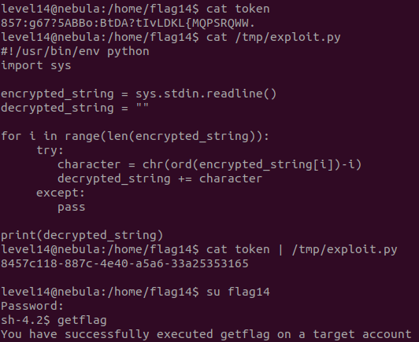

# Level 14

## Discription

> This program resides in /home/flag14/flag14. It encrypts input and writes it to standard output. An encrypted token file is also in that home directory, decrypt it :) \
\
> To do this level, log in as the level14 account with the password level14. Files for this level can be found in /home/flag14.

## Solution

This challenge was different from the previous challenges we have encountered. Encryption algorithm was simple, it adds index value of character to its ascii value.

```
Example - 
abc will be encrypted to ace
a -> ascii value of a + index value of a -> 97 + 0 = 97 -> a
b -> ascii value of b + index value of b -> 98 + 1 = 99 -> c
c -> ascii value of c + index value of c -> 99 + 2 = 101 -> e
```


we can make decryption algorithm using python

```python
#!/usr/bin/env python
import sys

encrypted_string = sys.stdin.readline()
decrypted_string = ""

for i in range(len(encrypted_string)):
     try:
     	character = chr(ord(encrypted_string[i])-i)
     	decrypted_string += character
     except:
	pass

print(decrypted_string)
```



## Python

```python
#!/usr/bin/python3

from pwn import *
from sys import argv,exit

if len(argv) < 2:
	sys.exit("Target IP Missing") 

level14 = ssh(host=argv[1],user='level14',password='level14')
encrypted_token = (level14.download_data('/home/flag14/token')).decode()
decrypted_token = ""

for i in range(len(encrypted_token)):
	try:
		character = chr(ord(encrypted_token[i])-i)
		decrypted_token += character
	except:
		pass

level14.close()

log.success(f'Got flag14 password : {decrypted_token}')

flag14 = ssh(host=argv[1],user='flag14',password=decrypted_token[:-1])
flag14_shell = flag14.shell('sh')
flag14_shell.sendline("getflag")
flag14_shell.interactive(prompt="")
```
